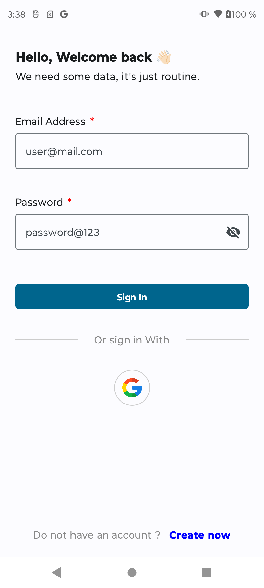
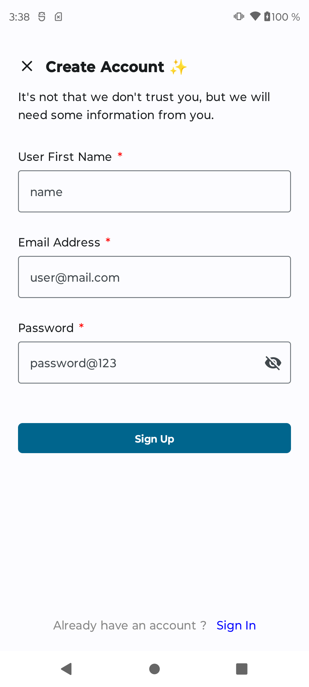
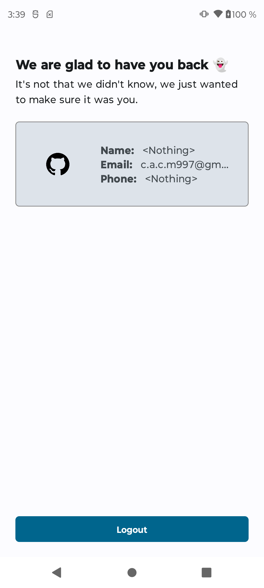

# Android Session Manager

I created this small module with the purpose of managing, in a simple but secure way, the sessions in Android applications, allowing the integration of external authentication systems, adding more flexibility to the module.

## Installation

Add below codes to your root (project) build.gradle file:

```groovy
allprojects {
    repositories {
        maven { url = uri("https://jitpack.io") }
    }
}
```

Then add the dependency to the builde.gralde of your module:

```groovy
dependencies {
    implementation("com.github.crisacm:android-session-manager:<latest-release>")
}
```

## How to Use

### Get SessionManager instance

To obtain the instance of `SessionManager`, use the `getInstance` method of `SessionManagerProvider`, where we must pass by parameter the implementation of AuthenticationManager together with the context of the application:

```kotlin
val sessionManager = SessionManagerProvider.getInstance(authenticationManager, context)
```

* #### Registering a session

To register a new session, use the `registerSession` method:

```kotlin
suspend fun registerSession(sessionInfo: SessionInfo)
```

* #### Clearing the session

To clear the current session, use the `clearSession` method:

```kotlin
suspend fun clearSession()
```

* #### Get session information

To get the current session information, use the `getSessionInfo` method:

```kotlin
fun getSessionInfo(): Flow<SessionInfo?>
```

* #### Check if the session is active

To check if the session is active, use the `isSessionActive` method:

```kotlin
fun isSessionActive(): Flow<Boolean>
```

* #### Configuring options

To configure options in the `SessionManager`, use the `configure` method:

```kotlin
fun configure(options: Map<String, Any>)
```


* #### Get an option

To get a specific option, use the `getOption` method:

```kotlin
fun getOption(key: String): Any?
```

* #### Validate the session

To validate the session, use the `validateSession` method:

```kotlin
suspend fun validateSession(key: ValidateSessionKeys, value: String): SessionValidationResult
```

## Demo App

This application demonstrates in a very basic way how the module works by performing a login through the Firebase Authentication tool in order to demonstrate in a flexible way how to use the library in a basic scenario.

<p>
  
  
  
</p>

## Tech Stak - Demo App

This application implements many of the most popular libraries in the Android ecosystem.

* **100% Kotlin**
  * [Coroutines](https://kotlinlang.org/docs/reference/coroutines-overview.html) - perform background operations
  * [Kotlin Flow](https://kotlinlang.org/docs/flow.html) - data flow across all app layers, including views
  * [Kotlin Serialization](https://kotlinlang.org/docs/serialization.html) - parse [JSON](https://www.json.org/json-en.html)
  * [Lifecycle](https://developer.android.com/topic/libraries/architecture/lifecycle) - perform an action when lifecycle state changes
  * [ViewModel](https://developer.android.com/topic/libraries/architecture/viewmodel) - store and manage UI-related data in a lifecycle-aware way
* **Jetpack**
  * [Navigation](https://developer.android.com/topic/libraries/architecture/navigation/) - in-app navigation
  * [Splash Screen API](https://developer.android.com/develop/ui/views/launch/splash-screen?hl=es-419)
* **Firebase**
    * [Authentication](https://firebase.google.com/docs/auth?hl=es-419)
    * [Crahslitycs](https://firebase.google.com/docs/crashlytics?hl=es-419)
* [Koin](https://insert-koin.io/) - dependency injection (dependency retrieval)
* [Coil](https://github.com/coil-kt/coil) - image loading library
* [Clean Architecture](https://blog.cleancoder.com/uncle-bob/2012/08/13/the-clean-architecture.html)
  * MVI Architecture
  * [Android Architecture components](https://developer.android.com/topic/libraries/architecture)
* **UI**
    * [Jetpack Compose](https://developer.android.com/jetpack/compose) - modern, native UI kit (used for Fragments)
    * [Material Design 3](https://m3.material.io/) - application design system providing UI components
    * Theme selection
        * [Dark Theme](https://material.io/develop/android/theming/dark) - dark theme for the app (Android 10+)
        * [Dynamic Theming](https://m3.material.io/styles/color/dynamic-color/overview) - use generated, wallpaper-based theme (Android 12+)
* **Gradle**
    * [Gradle Kotlin DSL](https://docs.gradle.org/current/userguide/kotlin_dsl.html)
    * [Versions catalog](https://docs.gradle.org/current/userguide/platforms.html#sub:version-catalog)
    * [Type safe accessors](https://docs.gradle.org/7.0/release-notes.html)

## Contribution

Please fork this repository and contribute back using pull requests.

Any contributions, large or small, major features, bug fixes, are welcomed and appreciated but will be thoroughly reviewed
