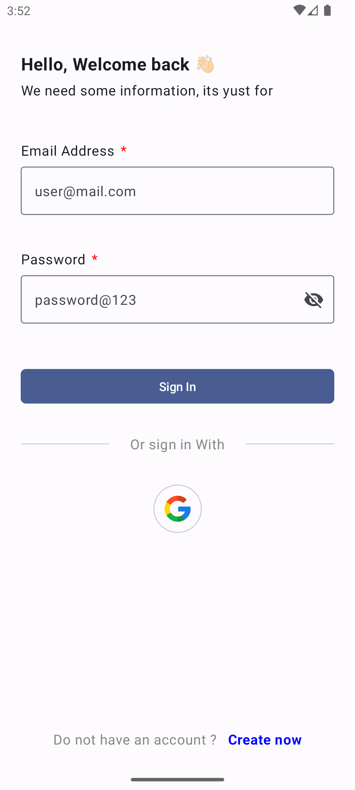

# Android Session Manager

This small project is to provide a quick and easy way to manage sessions within Android applications, this using DataStore storage together with Proto Database.


## Installation

Installation
Add below codes to your root build.gradle file (not your module build.gradle file).

```groovy
allprojects {
    repositories {
        maven { url = uri("https://jitpack.io") }
    }
}
```

Then add the dependency to the builde.gralde of your module

```groovy
dependencies {
    implementation("com.github.crisacm:android-session-manager:0.0.1")
}
```

## How to Use

The implementation must be carried out through the `SessionManagerInstance` instance, which allows access to the necessary functions for session management.

* ### `signIn`

The `signIn` function is used to register a session, closing the previous one (the record of the previous session is deleted), this function receives 3 parameters:

- `user`: User name with which the session is registered.
- `pass`: Password of the session, which can be replaced by a token.
- `args`: An argument map in case more session information needs to be stored.

```kotlin
SessionManagerInstance.signIn(
  user = "Cris",
  pass = "123",
  args = mapOf("key" to "value")
)
```

* ### `logout`

With this function we will close the last active session, this function returns the session that is being closed and in case there is no active session a null value will be returned.

```kotlin
SessionManagerInstance.logout()
```

* ### `getSignInDate`

Returns the date under the pattern "dd/MM/yyyy" of the active session, in case there is no session the value returned is null.

```kotlin
SessionManagerInstance.getSignInDate().collect()
```

* ### `getSignIn`

This function returns, in case there is a session, a `SessionInfo` type object which contains all the parameters of the session, in order to have a more precise control of the information in case it is required all together.

```kotlin
data class SessionInfo(
  var user: String,
  var password: String,
  var args: Map<String, String>,
  var signInDate: String, // Pattern DD/MM/YYYY
  var isLogged: Boolean
)

SessionManagerInstance.getSignIn().collect()
```

* ### `isSignIn`

Retorna el valor `true` en caso de la sesión se encuentre activa y `false` en caso contrario.

```kotlin
SessionManagerInstance.isSignIn().collect()
```

## Demo App

This application demonstrates in a very basic way how the module works by performing a login through the Firebase Authentication tool in order to demonstrate in a flexible way how to use the library in a basic scenario.

<p>
  
  
  
</p>


## Tech Stak - Demo App

This application implements many of the most popular libraries in the Android ecosystem.

* Tech-stack
    * [100% Kotlin](https://kotlinlang.org/)
        + [Coroutines](https://kotlinlang.org/docs/reference/coroutines-overview.html) - perform background operations
        + [Kotlin Flow](https://kotlinlang.org/docs/flow.html) - data flow across all app layers, including views
        + [Kotlin Serialization](https://kotlinlang.org/docs/serialization.html) - parse [JSON](https://www.json.org/json-en.html)
    * [Jetpack](https://developer.android.com/jetpack)
        * [Compose](https://developer.android.com/jetpack/compose) - modern, native UI kit
        * [Navigation](https://developer.android.com/topic/libraries/architecture/navigation/) - in-app navigation
        * [Splash Screen Core]()
        * [Lifecycle](https://developer.android.com/topic/libraries/architecture/lifecycle) - perform an action when
          lifecycle state changes
        * [ViewModel](https://developer.android.com/topic/libraries/architecture/viewmodel) - store and manage UI-related
          data in a lifecycle-aware way
    * [Firebase](https://firebase.google.com/?hl=es-419)
        * [Authentication](https://firebase.google.com/docs/auth?hl=es-419)
        * [Crahslitycs](https://firebase.google.com/docs/crashlytics?hl=es-419)
    * [Koin](https://insert-koin.io/) - dependency injection (dependency retrieval)
    * [Coil](https://github.com/coil-kt/coil) - image loading library
    * [Clean Architecture](https://blog.cleancoder.com/uncle-bob/2012/08/13/the-clean-architecture.html)
    * MVVM + MVI (presentation layer)
    * [Android Architecture components](https://developer.android.com/topic/libraries/architecture)
      ([ViewModel](https://developer.android.com/topic/libraries/architecture/viewmodel)
      , [Kotlin Flow](https://kotlinlang.org/docs/flow.html)
      , [Navigation](https://developer.android.com/jetpack/androidx/releases/navigation))
    * [Android KTX](https://developer.android.com/kotlin/ktx) - Jetpack Kotlin extensions
* UI
    * [Jetpack Compose](https://developer.android.com/jetpack/compose) - modern, native UI kit (used for Fragments)
    * [Material Design 3](https://m3.material.io/) - application design system providing UI components
    * Theme selection
        * [Dark Theme](https://material.io/develop/android/theming/dark) - dark theme for the app (Android 10+)
        * [Dynamic Theming](https://m3.material.io/styles/color/dynamic-color/overview) - use generated, wallpaper-based
          theme (Android 12+)
* Gradle
    * [Gradle Kotlin DSL](https://docs.gradle.org/current/userguide/kotlin_dsl.html) - define build scripts
    * [Versions catalog](https://docs.gradle.org/current/userguide/platforms.html#sub:version-catalog) - define dependencies
    * [Type safe accessors](https://docs.gradle.org/7.0/release-notes.html)

## Contribution

Please fork this repository and contribute back using pull requests.

Any contributions, large or small, major features, bug fixes, are welcomed and appreciated but will be thoroughly reviewed